# 作业题目

C语言的语法分析器

# 基本信息

| 姓名   | 班级       | 学号       | 专业             | 指导老师 |
| ------ | ---------- | ---------- | ---------------- | -------- |
| 杨元睿 | 2019211307 | 2019211447 | 计算机科学与技术 | 张玉洁   |


# 运行环境

| 编译器             | 语言 | 标准          | 平台  |
| ------------------ | ---- | ------------- | ----- |
| visual studio 2019 | c++  | c++11或者以上 | win10 |


# 实验要求

- 可以识别出用C语言编写的源程序中的每个单词符号。并且以记号形式输出每个单词符号。
- 可以跳过注释。
- 可以统计程序中的语句行数，各类单词的个数，以及字符总数。
- 检查源程序中的词法错误，并且可以报告错误的位置。
- **对错误适当的恢复。可以让词法分析继续进行。**
- 一次扫描即可。

# 我的理解(假设)

## 关于C语言的说明
1. 标识符。标识符是以`_`或者字母开头的一串字符串。其实是有长度限制的。但是标准已经将长度大大加长，并且不同的编译器也不一样。所以这里我就不提出警告了。
2. 数字。数字是以**整数部分+小数部分+指数部分构成的**。后面会详细说明。
3. 关键字。我这里默认C语言中有32个关键字。
4. 界符。也可以叫做标点符号。主要有`(` `)` `[` `]` `;` `:` `{` `}` `'` `""` 这几种。
5. 注释。`/*  */` 和 `//`。其中`//`要配合`\n`来判断。是不是结束了。
6. 分隔符。`' '`、`'\t'`、`'\n'`。一定要注意不是只有空格是分隔符。遇到其他的也要做处理。
7. 运算符。
   1. 算数运算符。`+` `-` `*` `/` `%` `++` `--`
   2. 逻辑运算符。`&&` `||` `!` 
   3. 位操作运算符。`&` `|` `~` `^` `>>` `<<`
   4. 赋值运算符。`=` `+=` `-=` `*=` `/=` `%=` `&=` `|=` `~=` `^=` `>>=` `<<=`
   5. 关系运算符。`>` `<`  `==` `<=` `>=` `!=` 
   6. 一些要考虑的特殊的。`->` `.` 这两个是结构体结构体指针用的。

## 关于错误处理的说明

- 本程序是词法分析。所以能够处理的错误是：单词拼写错误比如 `int a  = 0xGG` 。非法字符比如程序里有`@`这些非法字符。
- 其他错误不在我的处理范围。一开始我也想错了。比如语句之后有没有`;`。这个首先要识别是不是是个句子，已经超出了语法分析的范畴了。

## 对于预编译命令
- 这里我认为是属于预处理器的阶段，并不由词法分析来管。
- 我的处理是一旦读到 `#` 就进入处理，然后读到`"\n"`就结束。

## TOKEN的形式

- < 种别码, 属性值>
- 很多词是我是一词一码的。比如`while` `[` 等等。输出形式：`< while , - > `
- 赋值号和比较符号我是一类一码。比如 `+=` `<` 等等。输出形式：`< asign , = > ` `< relop , LT > `

## 关于识别数字
数字有三种形式：

1. 10进制的数。这个不仅仅包含整数。也包含小数和指数。比如`123.123e10`。**注意：经过我直接在编译器的里的测试 `.123 ` `123.e10`其实都是可以编译通过的。也就是是说`.`前面可以没有字符，点后面也没有字符。**

2. 8进制数。以0开头。比如`0123`

3. 16进制数。以0x开头。比如`0xffff`

4. **引入了8进制之后就会有这种情况。`00123.123e123`。那么这个到底是算作错误的8进制数，还是算成有前导0的十进制数呢？**我在编译器里面测试结果如下。

   

## 错误
0. 标识符不能以数字开头
1. 有不合法的字符
2. 数字形态不正确
3. 注释没有闭合
4. 字符没有闭合
5. 字符长度太长
6. 字符串没有闭合
7. 字符串里有非法字符
8. **字符为空 `''`这种就是不合法的** (一开始没有想到，但是要注意字符串可以为空`""`)

# 我的设计与实现

## 识别标识符的自动机


## 识别数字的自动机


**识别数字是最困难的一步。费了很多心思。PPT上关于识别数字的过程并不完整。尤其要考虑C语言有8进制和16进制的区别。**

##  识别预处理 字符 注释 字符串的自动机


## 识别各种符号的自动机

这里我就不一一贴出了。只是贴出一个样例。呈现出我的设计思想。就是在识别的时候我要给符号分类。因为其实不同符号是有很大不同的。

比如 `-` 可以扩展出。`--` `-=` `->` 这三种符号。但是 `%` 就只能扩展出 `%=` 这一种符号。所以对于不同的符号。我是把它都分成了不同的`case`来分别建自动机。

 

对应的程如下图，只截图了部分。就不一一列举了。


## 关于自动机的补充

如果某个状态读入了一个字符。这个字符不在接下来任何的转译路径上。那么此时就可以进行一些操作，最终转换到`state0`。

比如`123abc`他会在读到`a`的时候发现是非法的。然后**指针回退**。先把`123`是个数字识别出来。然后进入`state0`之后接着识别`abc`。会再把`abc`识别出来。**但显然`123abc`是一个不合法的格式。所以还会进入错误处理程序报错**。

很显然我们还有一种做法。那就是把`123abc`直接抛弃。然后报错。进入`state0`。

我认为这两种做法都是可以的。因为无论怎么样最终都报错了。所以其实进入一些错误情况的时候，会有不同的操作的。我选择的是第一种方法。

处理错误的一些转移我没有在上面自动机的图片里标出。因为基本都是转移到`state0`。

## 符号表的设计

下面的表格中。第一个是指哈希表。并不是表里的属性。只是做一个索引用。

例如 `symbol["yyr"]`。后面的才是符号表的内容。

| hash | name(名字) | property(属性) | class | type | value |
| ---- | ---------- | -------------- | ----- | ---- | ----- |
|      | `yyr`      | `id`           | -     | -    | -     |

我们可以发现。后三个实际上在词法分析阶段都是不能填写的。`class`其实是看它的作用域在哪里。`type`是指出它的类型 `int` `ptr` 还是什么。`value`是指这个的值。这个其实都要通过对于句子的识别来了。比如 `int yyr = 3 `。这个显然不是我们词法分析要做的。

所以在词法分析里，为了方便其实最终就只有两项就好了。但是如果为了后面和其他的对接，应该要保留后面的所有项目。但好像老师说过是独立的。所以就先两项。

## 关于缓冲区

虽然现在缓冲区都够用了。但是为了预防万一我还是实现一下。

其实分析的时候直接用`getline`读取每一行就好了。但是如果真的有人恶意写的程序一直都是一行。一直打`aaaaa`。打个几个GB的。这样就会崩溃。

我采用的方法和书上相同。就是把一个缓冲区拆成两块。但是我采用了更简便的方法。就是设置了`flag`的标识位。

```c++
if (this->pointer2 == 0 && flag==0)
	{
		cnt = fread(this->buffer, sizeof(char), hBLength, this->cProgram);
		if (cnt < hBLength) buffer[cnt] = -1;//添加结束符号 因为fread不会把-1读入
		flag = 1;
	}
		
	if (this->pointer2 == hBLength && flag == 1)
	{
		cnt = fread(this->buffer + hBLength, sizeof(char), hBLength, this->cProgram);
		if (cnt < hBLength) buffer[cnt+hBLength] = -1;//添加结束符号 因为fread不会把-1读入
		flag = 0;
	}
```

**这样做是为了防止指针回退的时候重复判断。多读入一次。把还未分析的数据冲掉。**


设置`flag`就可以让读入的时候比如一次前 一次后 一次前 一次后 交互执行。不允许出现两次读入到前半段或者后半段的时候。

## 关于指针回退(一开始我不知道为什么要回退，现在明白了)

之前一直提到指针回退的概念。一开始并不知道指针回退是干嘛的。

**比如`a+b`。当我们识别到`+`之后现在组成的字符是`a+`。这显然不符合条件。但是此时`+`已经被读入了。如果继续识别。那么直接识别的是`b`。很显然我们就会把`+`吞了。所以当识别到`a+`的时候。我们要让指针回退。然后状态回到`state0`。接着从`state0`再次读取字符。那么读取的就是`+`号了。可以识别出`+`号了。**

这种处理方法很简单也很高效。

## 部分实现代码展示与说明

### 类里面的函数和数据结构

```c++
class analyzer
{
public:
	analyzer();//构造函数
	~analyzer();//析构函数 
	bool getTheCProgram();
	bool iniKeyWords();//初始化哈希表
	bool inierrorType();//初始化错误类型
	bool readFileToBuffer();//读入到缓冲区 这个函数后来没用 因为直接集成到 手写的 getChar()里
	void changeState();//改变state的状态
	bool canMakeId(char c);//可不可以是标识符
	bool canMake8Base(char c);//可不可以生成8进制
	bool canMake16Base(char c);//可不可以生成16进制
	bool isDigit(char c);//是不是数字
	bool isLetter(char c);//是不是数字
	bool isUnderline(char c);//是不是下划线
	void dealError(string info="");//根据错误表打印错误
	char getChar();//自己手写的配合缓冲区切换的getchar
	void fallBackPoint();//回退指针 利用 mod运算
	void printResult(string info="");//打印每个识别到的单词 根据info传的类别不同
	void printSum();//打印汇总信息 统计多少行 多少单词 符号
public:
	FILE* cProgram; //输入C程序文件指针
	FILE* resultFile;//输出记号流的文件指针
	FILE* sumFile;//输出汇总信息的文件指针
	FILE* errorFile;//输出错误信息的文件指针
	FILE* errorType;//只读文件 用于读取错误的种类
	char buffer[bLength];//指针
	int pointer1;//第一个指针
	int pointer2;//第二个指针
	bool willEnd;//提示读取的文件是不是将要结束了 后来没用到
	int lineNum;//实际行号
	int pLineNum;//预测行号
	int wordNum;//单词的数量
	unordered_map<string, pair<string,string>> keyWords;//关键字的哈希表
	unordered_map<string, int> numOfWords;//所有字符的哈希表
	unordered_map<string, pair<string, string>> symbolTable;//id的符号表 删减版 详细见实验报告
	vector<string> errorVector;//错误表
	int state;//状态
	string token;//已经扫过的一个单词
	bool flag = 0;//用于切换缓冲区的服务
};
```

### 最主要的函数

#### 整体结构

最主要的函数是`void changeState()`函数。也是代码的关键所在。

这个函数就是一直读入字符然后来不停地状态转换和分析。

采取的框架仍然是利用`switch` `case` 来实现。以下是部分代码。

```c++
	char ch = 0;
	while (1)
	{
		if (ch == -1) break;
		switch (this->state)
		{
		case 0: //初始状态
		{
			//不断地读取字符 但是遇到空格和tab要忽略
			token.clear();
			while (1)
			{
				ch = this->getChar();
				this->lineNum = this->pLineNum;
				if (ch != ' ' && ch != '\t') break; //如果不是空格和tab就可以进入下一步 如果是就一直重复读取
			}
			//识别字符
			switch (ch)
			{
```

整体是一个无限循环。只有碰到`EOF`也就是`-1`。才会停止。里面就是先针对状态的`switch`。接着就是状态里面根据不同字符的判断 用 `if`或者`switch`。

#### 细节之错误处理和正常识别

```c++
	else
			{
				state = 0;//转换到初始状态
				this->fallBackPoint();//回退指针
				if (this->keyWords.count(this->token))//判断是不是在关键字表里
				{
					this->printResult();
				}
				else
				{
					this->printResult("id");
				}
			}
```

以上是一段正常识别的例子。这里我们可以看到。正常识别也要回退指针。比如`abc+def`。如果一个单词没有边界。肯定是无法正常识别的。也就是说碰壁了。就可以识别了。识别`abc`的时候遇到了`+`号。表明`abc`是一个标识符。结束了。但是`+`仍然要被识别。所以要回退指针。状态回到0。

```c++
	else if(isLetter(ch) || isUnderline(ch))
			{
				state = 0;
				fallBackPoint();
				dealError("0");
				//加入
				printResult("dec");
			}
```

这是一段错误的例子。这里我们可以看到。相比正常识别。它会多了一步。`dealError`。比如`0123abc`。当`0123`识别到`a`的时候就结束了。虽然`abc`可以继续被识别。但是这种数字开头的方式是不会被允许的。所以要报错。报不报错是由当前状态和判断所决定的。

### 输出

我是以文件的形式来输出的。

```c++
	else if (info == "id")
	{
		fprintf(resultFile, "line : %d < %s , %s > \n", this->lineNum, "id", token.c_str());
		this->numOfWords["id"]++;
		if (this->symbolTable.count(token) == 0)
		{
			this->symbolTable[token] = { "id",token };
		}
	}	
```

上述这段代码可以看到。我输出到了文件中。并且输出之后把它存到了符号表里。注意：由于我使用了哈希表来优化。所以标识符的输出和存储和一般不同。

| a    | b    | c    | d    |
| ---- | ---- | ---- | ---- |

如果是这种方式那么输出应该是。`<id,0> <id,1> <id,2>`等等。因为虽然是a。但是它其实是符号表的第0项。由于是线性表。所以必须要后面有个数是入口指针。否则从头到尾便利实在太慢。

但是我采用的是。

`unordered_map<string, ...................>>` 直接就把一个字符串映射到了某个地址。那么此时就可以输出`<id,a> <id,b>`等等了。字符串就是它的符号表的索引。

# 程序使用方法以及样例测试

## 程序使用方法

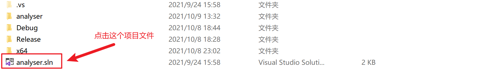

接下来会进入程序的主界面

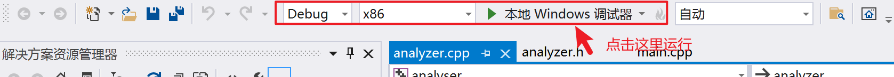

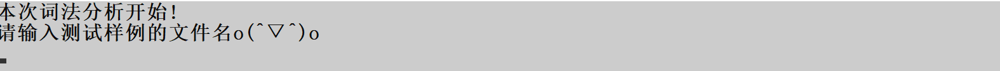

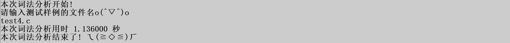

运行之后会弹出这个对话框代表结束了。接下来我们查看结果。

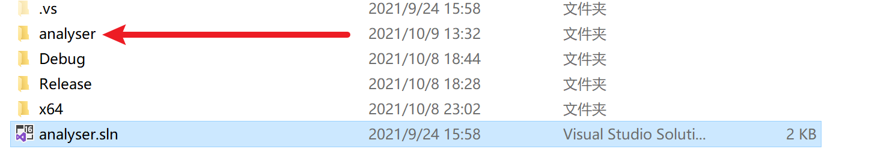

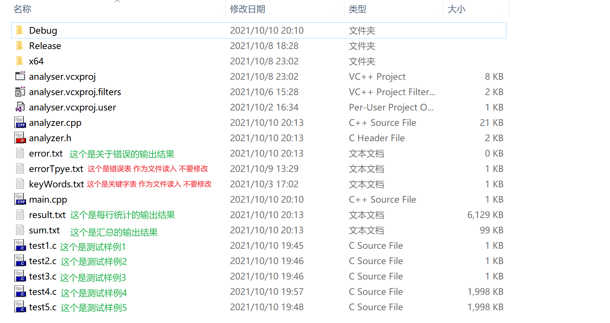

## 样例测试

### 1.普通小程序测试+混乱排版

#### test1.c

```c++
# include <stdio.h>
# include           <stdlib.h>

int main(void)
{
	int a;
				int b;
	a = 100;
	a = 	.1e3;
	int c = 3;
	printf("%d",a+b);
				if(a)
				{
					while(a--)
					{
						++b;
						++c;
					}
					if(b <=   c)
					{
						printf("%s","Cowboy Bebop");
					}
					
				}
				
	switch(a)
	{
		case 3 :
		case 7 :
		default :
			break;		
	}
	
	return 0;
}

```

#### error.txt

无结果 因为无词法错误

#### result.txt

```txt
line : 4 < int , - > 
line : 4 < id , main > 
line : 4 < ( , - > 
line : 4 < void , - > 
line : 4 < ) , - > 
line : 5 < { , - > 
line : 6 < int , - > 
line : 6 < id , a > 
line : 6 < ; , - > 
line : 7 < int , - > 
line : 7 < id , b > 
line : 7 < ; , - > 
line : 8 < id , a > 
line : 8 < asign , = > 
line : 8 < dec , 100 > 
line : 8 < ; , - > 
line : 9 < id , a > 
line : 9 < asign , = > 
line : 9 < dec , .1e3 > 
line : 9 < ; , - > 
line : 10 < int , - > 
line : 10 < id , c > 
line : 10 < asign , = > 
line : 10 < dec , 3 > 
line : 10 < ; , - > 
line : 11 < id , printf > 
line : 11 < ( , - > 
line : 11 < str , %d > 
line : 11 <  ,  > 
line : 11 < id , a > 
line : 11 < + , - > 
line : 11 < + , - > 
line : 11 < id , b > 
line : 11 < ) , - > 
line : 11 < ; , - > 
line : 12 < if , - > 
line : 12 < ( , - > 
line : 12 < id , a > 
line : 12 < ) , - > 
line : 13 < { , - > 
line : 14 < while , - > 
line : 14 < ( , - > 
line : 14 < id , a > 
line : 14 <  ,  > 
line : 14 < ) , - > 
line : 15 < { , - > 
line : 16 <  ,  > 
line : 16 < id , b > 
line : 16 < ; , - > 
line : 17 <  ,  > 
line : 17 < id , c > 
line : 17 < ; , - > 
line : 18 < } , - > 
line : 19 < if , - > 
line : 19 < ( , - > 
line : 19 < id , b > 
line : 19 < relop , LE > 
line : 19 < id , c > 
line : 19 < ) , - > 
line : 20 < { , - > 
line : 21 < id , printf > 
line : 21 < ( , - > 
line : 21 < str , %s > 
line : 21 <  ,  > 
line : 21 < str , Cowboy Bebop > 
line : 21 < ) , - > 
line : 21 < ; , - > 
line : 22 < } , - > 
line : 24 < } , - > 
line : 26 < switch , - > 
line : 26 < ( , - > 
line : 26 < id , a > 
line : 26 < ) , - > 
line : 27 < { , - > 
line : 28 < case , - > 
line : 28 < dec , 3 > 
line : 28 < : , - > 
line : 29 < case , - > 
line : 29 < dec , 7 > 
line : 29 < : , - > 
line : 30 < default , - > 
line : 30 < : , - > 
line : 31 < break , - > 
line : 31 < ; , - > 
line : 32 < } , - > 
line : 34 < return , - > 
line : 34 < oct , 0 > 
line : 34 < ; , - > 
line : 35 < } , - > 
```

可以看到结果与上述小程序符合

#### sum.txt

```txt
此程序一共有36行
此程序一共有89个单词

default有1个
int有4个
}有5个
=有3个
id有17个
void有1个
(有7个
)有7个
{有5个
;有11个
num有6个
str有3个
,有2个
+有2个
if有2个
while有1个
--有1个
++有2个
<=有1个
case有2个
switch有1个
:有3个
break有1个
return有1个

下面是本程序的标识符
< id, main>
< id, a>
< id, b>
< id, printf>
< id, c>
```

可以看到统计结果和源程序相符合。尤其是行数的统计。

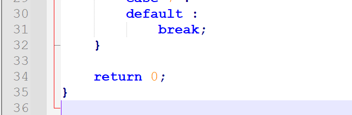

虽然最后没有字符了是空行。但是因为你在写程序的时候打了。所以也要统计进去。

### 2.各种错误的测试小程序+混乱排版

#### test2.c

```c
# include <stdio.h>
# include           <stdlib.h>
# include <cstring>

@ int m;

char c = '';

void test()
{
	int dist[100];
	memset(dist,-1,sizeof dist);
}

int c = 0xppppp;

char* 8989___cowboy;
char cowboy = '123123123123';
				int main(void)
				{
					/*
				}

```

#### errror.txt

```txt
5行 错误是: 有不合法的字符
7行 错误是: 字符为空
15行 错误是: 数字形态不正确
17行 错误是: 标识符不能以数字开头
18行 错误是: 字符长度太长
21行 错误是: 注释没有闭合
```

#### result.txt

```txt
line : 5 < int , - > 
line : 5 < id , m > 
line : 5 < ; , - > 
line : 7 < char , - > 
line : 7 < id , c > 
line : 7 < asign , = > 
line : 7 < ; , - > 
line : 9 < void , - > 
line : 9 < id , test > 
line : 9 < ( , - > 
line : 9 < ) , - > 
line : 10 < { , - > 
line : 11 < int , - > 
line : 11 < id , dist > 
line : 11 < [ , - > 
line : 11 < dec , 100 > 
line : 11 < ] , - > 
line : 11 < ; , - > 
line : 12 < id , memset > 
line : 12 < ( , - > 
line : 12 < id , dist > 
line : 12 <  ,  > 
line : 12 < - , - > 
line : 12 < - , - > 
line : 12 < dec , 1 > 
line : 12 <  ,  > 
line : 12 < sizeof , - > 
line : 12 < id , dist > 
line : 12 < ) , - > 
line : 12 < ; , - > 
line : 13 < } , - > 
line : 15 < int , - > 
line : 15 < id , c > 
line : 15 < asign , = > 
line : 15 < id , ppppp > 
line : 15 < ; , - > 
line : 17 < char , - > 
line : 17 < * , - > 
line : 17 < dec , 8989 > 
line : 17 < id , ___cowboy > 
line : 17 < ; , - > 
line : 18 < char , - > 
line : 18 < id , cowboy > 
line : 18 < asign , = > 
line : 18 < ; , - > 
line : 19 < int , - > 
line : 19 < id , main > 
line : 19 < ( , - > 
line : 19 < void , - > 
line : 19 < ) , - > 
line : 20 < { , - > 

```

#### sum.txt

```txt
此程序一共有23行
此程序一共有51个单词

int有4个
}有1个
=有3个
id有12个
{有2个
;有7个
char有3个
(有3个
void有2个
)有3个
[有1个
num有3个
]有1个
,有2个
-有2个
*有1个
sizeof有1个

下面是本程序的标识符
< id, m>
< id, c>
< id, test>
< id, dist>
< id, memset>
< id, cowboy>
< id, ___cowboy>
< id, ppppp>
< id, main>

```


### 3.一些特殊情况的小程序

#### test3.c


```c
char str[100] = "cowboy  \"";
float b = 0123.123;

struct p{
	int a;
	int b;
};

struct p* x;
x->a;
x->b;

```

- 这个程序里面有几种一开始让人忽略的特殊情况。**比如字符串里的`\"`那么此时他就真的代表字符串里有元素是`"`。**此时不能判断成结尾。因为判断成结尾了之后。很显然后面的引号就会没有匹配。就要报错。这个和事实情况不符合。
- `0123.123`不能被判断成8进制。我在正规编译器上做过测试。会把它当成10进制。
- `->`运算符很容易被忽略。容易把它识别成一个`-` 一个`>`号

#### error.txt

无

#### result.txt

```txt
line : 1 < char , - > 
line : 1 < id , str > 
line : 1 < [ , - > 
line : 1 < dec , 100 > 
line : 1 < ] , - > 
line : 1 < asign , = > 
line : 1 < str , cowboy  \" > 
line : 1 < ; , - > 
line : 2 < float , - > 
line : 2 < id , b > 
line : 2 < asign , = > 
line : 2 < dec , 0123.123 > 
line : 2 < ; , - > 
line : 4 < struct , - > 
line : 4 < id , p > 
line : 4 < { , - > 
line : 5 < int , - > 
line : 5 < id , a > 
line : 5 < ; , - > 
line : 6 < int , - > 
line : 6 < id , b > 
line : 6 < ; , - > 
line : 7 < } , - > 
line : 7 < ; , - > 
line : 9 < struct , - > 
line : 9 < id , p > 
line : 9 < * , - > 
line : 9 < id , x > 
line : 9 < ; , - > 
line : 10 < id , x > 
line : 10 < -> , - > 
line : 10 < id , a > 
line : 10 < ; , - > 
line : 11 < id , x > 
line : 11 < -> , - > 
line : 11 < id , b > 
line : 11 < ; , - > 

```

- 看第7行。它把字符串识别成了一个完整的。
- 看第12行。它分辨出了这个是10进制不是8进制。
- 看第10和35行。它分辨出了这个是`->`运算符。

#### sum.txt

```txt
此程序一共有12行
此程序一共有37个单词

char有1个
str有1个
}有1个
=有2个
]有1个
struct有2个
id有11个
{有1个
;有8个
[有1个
num有2个
float有1个
int有2个
*有1个
->有2个

下面是本程序的标识符
< id, str>
< id, b>
< id, x>
< id, p>
< id, a>

```

### 4.超长的程序进行压力测试+此部分为运行截图

#### test4.c

这个是我复制的一个非常长的程序。而我程序里的缓冲区只有2048字节。所以要用前面提到的算法。把缓冲区拆成两半。一点点交替读入。

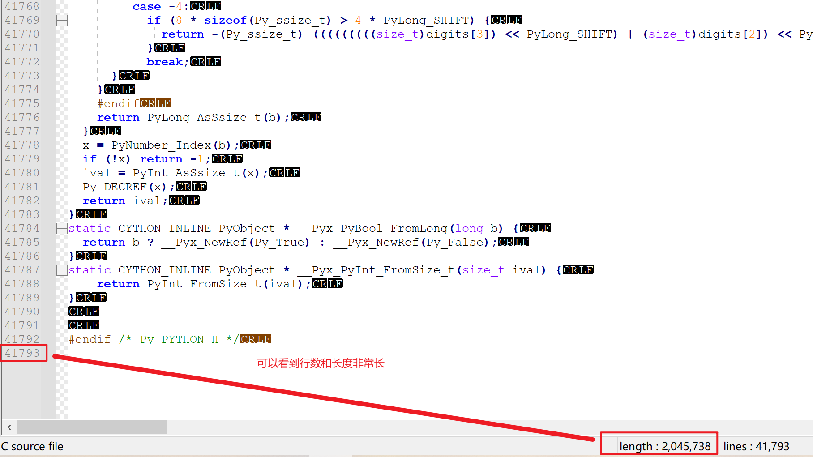

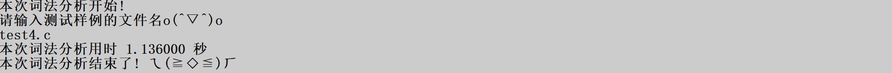

分析它花了不少时间。我们来看一下结果。尤其是result文件很大。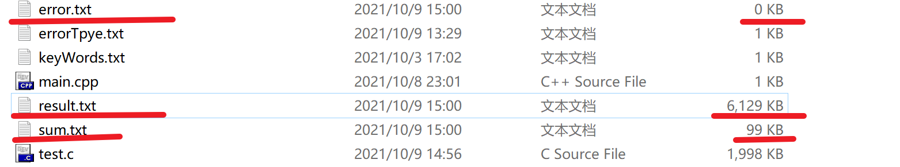

#### error.txt

无

#### result.txt

我们随便找几行来对比

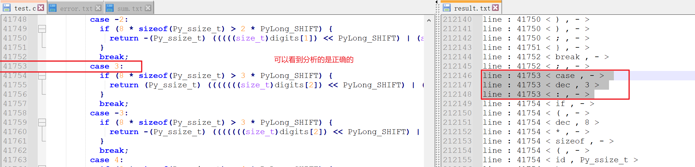

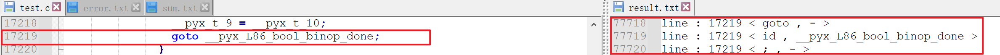

可以发现基本正确。也就是说本程序对缓冲区的测试是成功的。

#### sum.txt

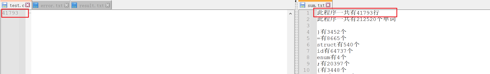

可以看到统计是正确的。

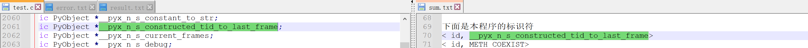

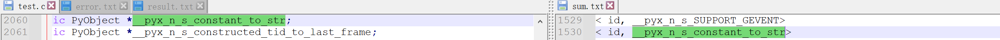

可以到符号表里任意的标识符都统计到了都标识了。**由于我用的是哈希表所以顺序可能会不同**

### 5.超长的程序+错误进行压力测试

#### test5.c

我在两万行放了一些错误

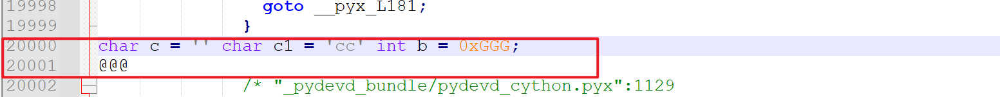

我又修改了程序让注释没有闭合

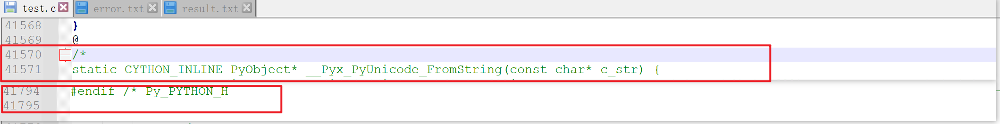

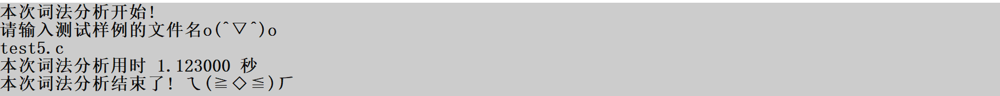

#### error.txt
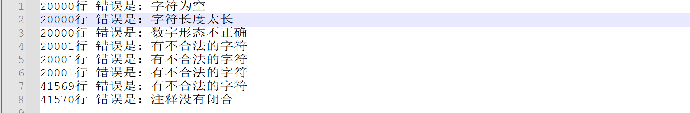

符合预期

#### result.txt
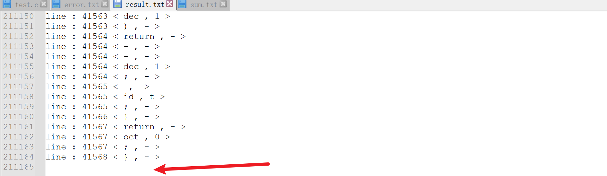

可以看到到最后因为全部注释掉了。所以后面的东西不记入词法分析了

#### sum.txt
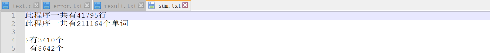

统计也是符合的

# 实验总结

## 程序的优点

- 较为完整的，基于自己给出的假设，完成了词法分析。并且各种情况基本考虑完善，尤其是数字，还有各种符号。
- 使用了哈希表`unordered_map`进行了优化。使得查表都是根据字符串索引`O(1)`的复杂度内实现。
- 改进了缓冲区的各种判断。设标志位。让它一直交替读入。

## 程序还可以完善的地方

- 对于转移字符的支持不够。因为在c语言中允许`\123` `\xa1` 这种转移字符。我并没有支持这种情况。我只支持普通的 `\n` 这些转义字符。
- 一些细小的语法没有支持。比如`123L`这种语法表示的是123是一个`long`的类型。这种类型我没有支持。
- 自动机的实现比较臃肿。其实有一种方法叫做**表驱动法**。可以让代码简洁很多。

## 实验的收获

- ==**"基于什么样的假设"**==。这个是上课的时候老师提醒的和强调的。我一开始不知道是什么意思，我也不知道有什么用。直到写程序的时候才知道。c语言的标准，规则都太多太多了。==**如果我不提前说我的假设的话，就会让看我程序的人摸不着头脑，**==就不会清楚我的词法分析到底实现到了什么样的程度！而且每个人的想法都是不一样的。这些东西都是很灵活的。有可能一个东西我认为该报错，你认为不报错。我认为有个东西的格式分类是这样的，你认为是那样的。==**如果我不提前说我的假设，那么别人阅读我的报告和程序的时候完全可以基于自己的假设去读。**==这样就乱套了。
- 本次实验也让我对编译的过程以及计算机更加了解了。如何以计算机的方式来思考问题，让它能够识别单词是个很重要的步骤。在思考这个过程中，我的编程水平也大有长进。