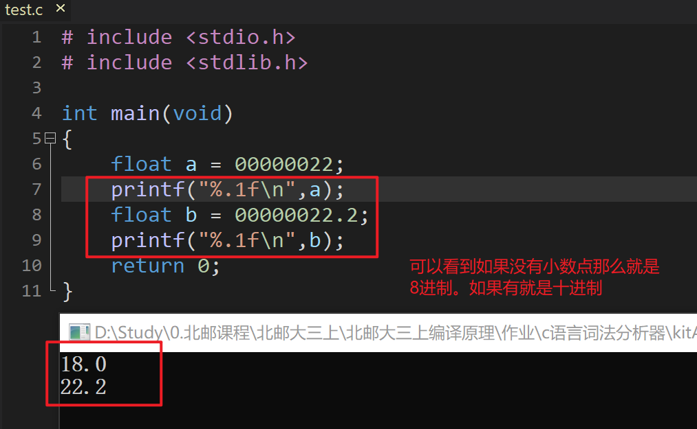
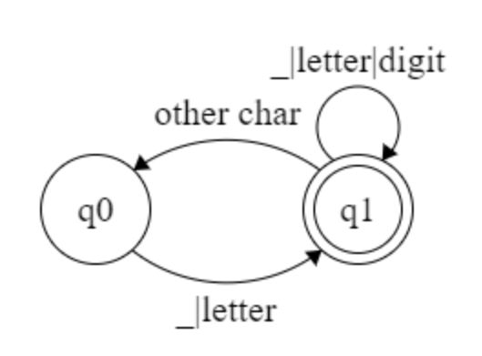
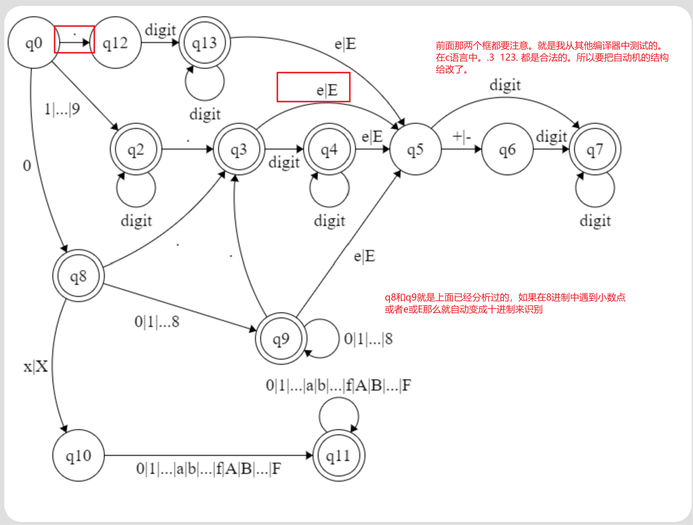
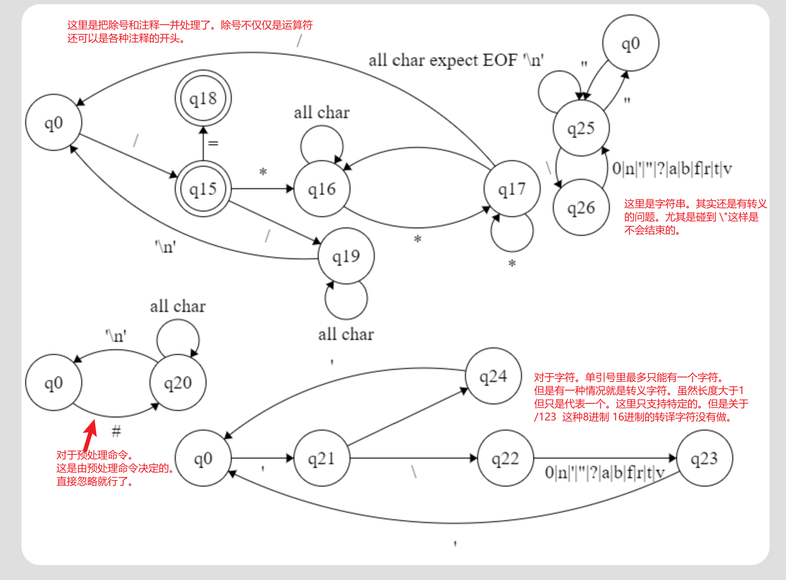
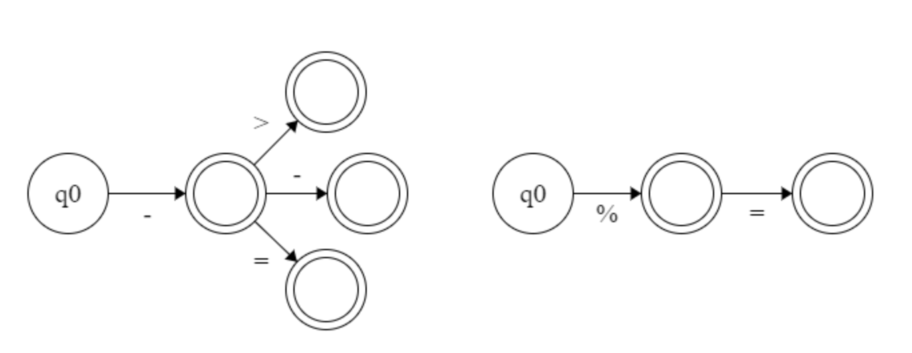
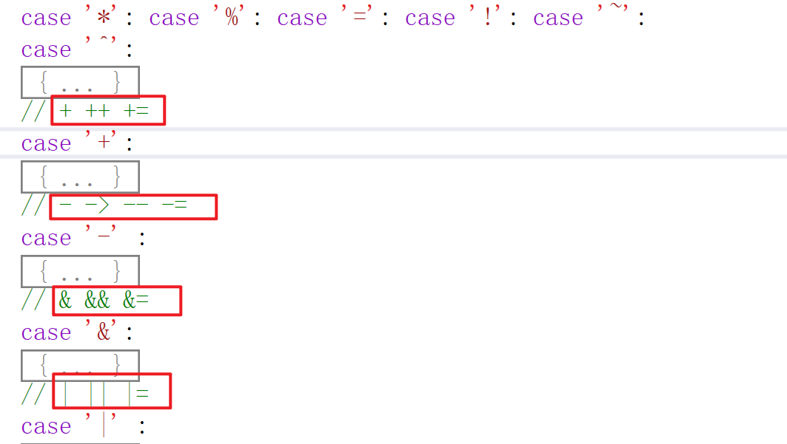
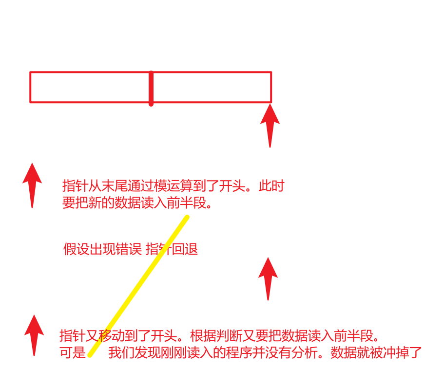

# 作业题目

C语言的语法分析器

# 运行环境

| 编译器             | 语言 | 平台  |
| ------------------ | ---- | ----- |
| visual studio 2019 | c++  | win10 |


# 实验要求

- 可以识别出用C语言编写的源程序中的每个单词符号。并且以记号形式输出每个单词符号。
- 可以跳过注释。
- 可以统计程序中的语句行数，各类单词的个数，以及字符总数。
- 检查源程序中的词法错误，并且可以报告错误的位置。
- 对错误适当的恢复。可以让词法分析继续进行。
- 一次扫描即可

# 我的理解(假设)

## 关于C语言的说明
1. 标识符。标识符是以`_`或者字母开头的一串字符串。其实是有长度限制的。但是标准已经将长度大大加长，并且不同的编译器也不一样。所以这里我就不提出警告了。
2. 数字。数字是以**整数部分+小数部分+指数部分构成的**。后面会详细说明。
3. 关键字。我这里默认C语言中有32个关键字。
4. 界符。也可以叫做标点符号。主要有`(` `)` `[` `]` `;` `:` `{` `}` `'` `""` 这几种。
5. 注释。`/*  */` 和 `//`。其中`//`要配合`\n`来判断。是不是结束了。
6. 分隔符。`' '`、`'\t'`、`'\n'`。一定要注意不是只有空格是分隔符。遇到其他的也要做处理。
7. 运算符。
   1. 算数运算符。`+` `-` `*` `/` `%` `++` `--`
   2. 逻辑运算符。`&&` `||` `!` 
   3. 位操作运算符。`&` `|` `~` `^` `>>` `<<`
   4. 赋值运算符。`=` `+=` `-=` `*=` `/=` `%=` `&=` `|=` `~=` `^=` `>>=` `<<=`
   5. 关系运算符。`>` `<`  `==` `<=` `>=` `!=` 
   6. 一些要考虑的特殊的。`->` `.` 这两个是结构体结构体指针用的。

## 关于错误处理的说明

- 本程序是词法分析。所以能够处理的错误是：单词拼写错误比如 `int a  = 0xGG` 。非法字符比如程序里有`@`这些非法字符。
- 其他错误不在我的处理范围。一开始我也想错了。比如语句之后有没有`;`。这个首先要识别是不是是个句子，已经超出了语法分析的范畴了。

## 对于预编译命令
- 这里我认为是属于预处理器的阶段，并不由词法分析来管。
- 我的处理是一旦读到 `#` 就进入处理，然后读到`"\n"`就结束。

## TOKEN的形式

## 关于识别数字
数字有三种形式：

1. 10进制的数。这个不仅仅包含整数。也包含小数和指数。比如`123.123e10`。**注意：经过我直接在编译器的里的测试 `.123 ` `123.e10`其实都是可以编译通过的。也就是是说`.`前面可以没有字符，点后面也没有字符。**

2. 8进制数。以0开头。比如`0123`

3. 16进制数。以0x开头。比如`0xffff`

4. **引入了8进制之后就会有这种情况。`00123.123e123`。那么这个到底是算作错误的8进制数，还是算成有前导0的十进制数呢？**我在编译器里面测试结果如下。

   

## 错误
0. 标识符不能以数字开头
1. 有不合法的字符
2. 数字形态不正确
3. 注释没有闭合
4. 字符没有闭合
5. 字符长度太长
6. 字符串没有闭合
7. 字符串里有非法字符

# 我的设计

## 识别标识符的自动机



## 识别数字的自动机



**识别数字是最困难的一步。费了很多心思。PPT上关于识别数字的过程并不完整。尤其要考虑C语言有8进制和16进制的区别。**

##  识别预处理 字符 注释 字符串的自动机



## 识别各种符号的自动机

这里我就不一一贴出了。只是贴出一个样例。呈现出我的设计思想。就是在识别的时候我要给符号分类。因为其实不同符号是有很大不同的。

比如 `-` 可以扩展出。`--` `-=` `->` 这三种符号。但是 `%` 就只能扩展出 `%=` 这一种符号。所以对于不同的符号。我是把它都分成了不同的`case`来分别建自动机。

 

对应的程如下图，只截图了部分。就不一一列举了。


## 关于自动机的补充

如果某个状态读入了一个字符。这个字符不在接下来任何的转译路径上。那么此时就可以进行一些操作，最终转换到`state0`。

比如`123abc`他会在读到`a`的时候发现是非法的。然后**指针回退**。先把`123`是个数字识别出来。然后进入`state0`之后接着识别`abc`。会再把`abc`识别出来。**但显然`123abc`是一个不合法的格式。所以还会进入错误处理程序报错**。

很显然我们还有一种做法。那就是把`123abc`直接抛弃。然后报错。进入`state0`。

我认为这两种做法都是可以的。因为无论怎么样最终都报错了。所以其实进入一些错误情况的时候，会有不同的操作的。我选择的是第一种方法。

处理错误的一些转移我没有在上面自动机的图片里标出。因为基本都是转移到`state0`。

## 符号表的设计

下面的表格中。第一个是指哈希表。并不是表里的属性。只是做一个索引用。

例如 `symbol["yyr"]`。后面的才是符号表的内容。

| hash | name(名字) | property(属性) | class | type | value |
| ---- | ---------- | -------------- | ----- | ---- | ----- |
|      | `yyr`      | `id`           | -     | -    | -     |

我们可以发现。后三个实际上在词法分析阶段都是不能填写的。`class`其实是看它的作用域在哪里。`type`是指出它的类型 `int` `ptr` 还是什么。`value`是指这个的值。这个其实都要通过对于句子的识别来了。比如 `int yyr = 3 `。这个显然不是我们词法分析要做的。

所以在词法分析里，为了方便其实最终就只有两项就好了。

## 关于缓冲区

虽然现在缓冲区都够用了。但是为了预防万一我还是实现一下。

其实分析的时候直接用`getline`读取每一行就好了。但是如果真的有人恶意写的程序一直都是一行。一直打`aaaaa`。打个几个GB的。这样就会崩溃。

我采用的方法和书上相同。就是把一个缓冲区拆成两块。但是我采用了更简便的方法。就是设置了`flag`的标识位。

```c++
if (this->pointer2 == 0 && flag==0)
	{
		cnt = fread(this->buffer, sizeof(char), hBLength, this->cProgram);
		if (cnt < hBLength) buffer[cnt] = -1;//添加结束符号 因为fread不会把-1读入
		flag = 1;
	}
		
	if (this->pointer2 == hBLength && flag == 1)
	{
		cnt = fread(this->buffer + hBLength, sizeof(char), hBLength, this->cProgram);
		if (cnt < hBLength) buffer[cnt+hBLength] = -1;//添加结束符号 因为fread不会把-1读入
		flag = 0;
	}
```

**这样做是为了防止指针回退的时候重复判断。多读入一次。把还未分析的数据冲掉。**



设置`flag`就可以让读入的时候比如一次前 一次后 一次前 一次后 交互执行。不允许出现两次读入到前半段或者后半段的时候。

## 关于指针回退(一开始我不知道为什么要回退，现在明白了)

之前一直提到指针回退的概念。一开始并不知道指针回退是干嘛的。

**比如`a+b`。当我们识别到`+`之后现在组成的字符是`a+`。这显然不符合条件。但是此时`+`已经被读入了。如果继续识别。那么直接识别的是`b`。很显然我们就会把`+`吞了。所以当识别到`a+`的时候。我们要让指针回退。然后状态回到`state0`。接着从`state0`再次读取字符。那么读取的就是`+`号了。可以识别出`+`号了。**

这种处理方法很简单也很高效。

